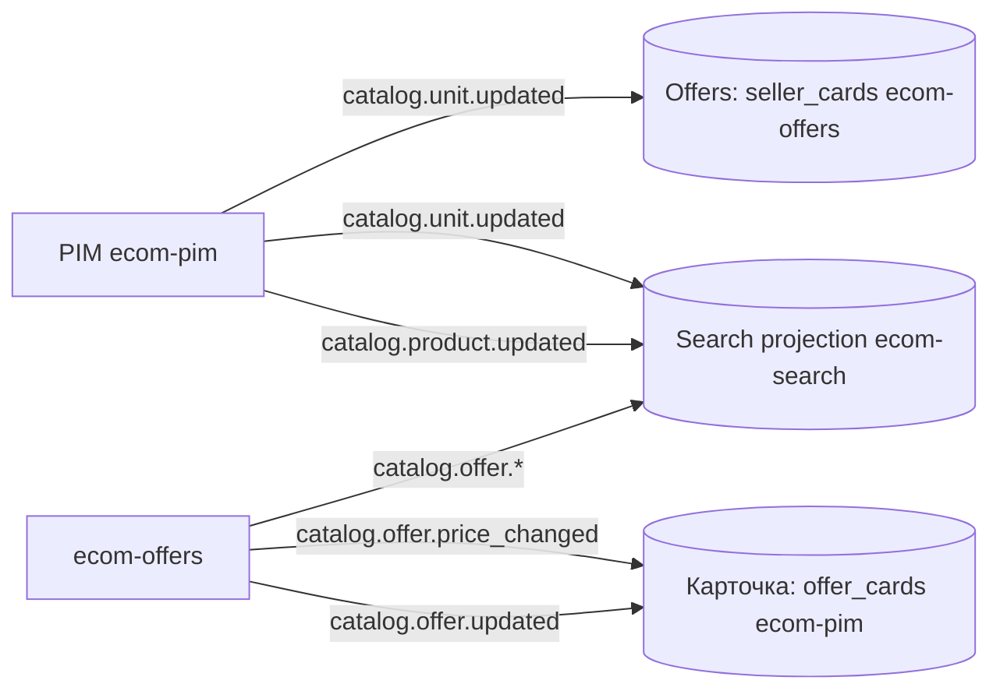

# EVENTS-001 — Модель событий платформы

> Реестр событий, продюсеров и консьюмеров платформы (слой Catalog — этап 2
> `short-plan.md`; эталон конверта для примитивов outbox/inbox — этап 1, PRD-033).
> Схемы — `schemas/*.json` (JSON Schema draft 2020-12), совместимость проверяется
> `cmd/breaking-check` (FR-004, BDD-032#S-6, S-7).
>
> **v0.3.1 (2026-08-02):** схемы реестра дополнены обязательными полями конверта
> по §1 (`event_type`, `schema_version`, `occurred_at`, `producer` + опциональные
> `correlation_id`, `causation_id`, `traceparent`) — BDD-034 S-14 (dead-letter на
> `schema_version`) реализуем по контракту. Поля цены переименованы в `price_cents`
> (`old_price_cents`/`new_price_cents`) с `minimum: 1` — единицы зафиксированы:
> деньги в событиях — целые копейки. Консьюмеры `catalog.product.updated` —
> только Search projection (карточка собирается из offer.*, ADR-001 ecom-pim);
> консьюмер Identity помечен future (этап 3); `seller_ids` — резерв этапа 3.
> Изменения breaking до GA (потребителей этапа 2 ещё нет).
>
> **v0.3.0 (2026-08-01):** каталог событий приведён к PRD-034/BDD-034:
> добавлено `catalog.product.updated.v1` (товар PIM → Search projection, FR-004);
> продюсер `catalog.offer.*` — сервис ecom-offers (владелец агрегата offer,
> ADR-001 ecom-pim, решение 1a); enum статусов unit изменён
> `[active, suspended, blocked]` → `[pending, active, suspended, closed]`
> (матрица переходов BDD-034 S-6). Изменение продюсеров и enum — breaking до GA
> (консьюмеры этапа 2 пишутся сразу под новый контракт).
>
> **v0.2.0 (2026-08-01):** конверт расширен с 3 полей до полного набора
> `docs/ensi-go-feasibility.md` (правило 7, строки 94–99) и согласован с
> `ERD-OB-001` (ecom-go-outbox/docs/ERD.md, сущность Envelope). Изменение
> контракта конверта — breaking для всех событий (см. §5).

## 1. Общий конверт (envelope) — эталон платформы

Все события имеют общие поля — они обязательны (`required`) в каждой схеме.
Набор полей — платформенный эталон (feasibility, строки 94–99; ERD-OB-001):

| Поле | Тип | Назначение |
|------|-----|------------|
| `event_id` | string(uuid) | идемпотентность (дубль `Nats-Msg-Id`); уникален на продюсера; в JetStream передаётся как `Nats-Msg-Id` |
| `event_type` | string | полное имя события: `ecom.<domain>.<aggregate>.<event>.v1` (без `env`!) |
| `schema_version` | integer | версия схемы события |
| `aggregate_id` | string | агрегат, к которому относится событие (например, `offer:<id>`) |
| `aggregate_version` | integer ≥ 1 | монотонная версия агрегата; устаревшие/дублирующие события не откатывают read model |
| `occurred_at` | timestamp | момент наступления события |
| `producer` | string | идентификатор сервиса-продюсера |
| `correlation_id` | string (опц.) | сквозная корреляция цепочек событий |
| `causation_id` | string (опц.) | событие-причина (сага/обработка) |
| `traceparent` | string (опц.) | W3C trace context |
| `payload` | object | доменное содержимое события |

**Нейминг (subject JetStream vs event_type в конверте):**

- subject публикации: `ecom.<env>.<domain>.<aggregate>.<event>.v1`
  (пример: `ecom.test.catalog.offer.updated.v1`) — совпадает с контрактом BDD-033
  и `outbox_events.topic` (ERD-OB-001);
- `event_type` в конверте: `ecom.<domain>.<aggregate>.<event>.v1` — без `env`
  (пример: `ecom.catalog.offer.updated.v1`);
- `$id` схемы в этом реестре: `<domain>.<aggregate>.<event>.v1` — без `ecom.`-префикса
  (пример: `catalog.offer.updated.v1`), префикс `ecom.` добавляется при публикации.

Правила идемпотентности: консьюмер применяет событие только если его
`aggregate_version` строго больше последней применённой для этого `aggregate_id`
(см. `docs/short-plan.md` §2 — «дубль или устаревшее событие не должны откатывать
read model»); дубль `Nats-Msg-Id` отсекается уникальным `inbox_events.event_id`
(ERD-OB-001, INV-2).

**Поля конверта в схемах реестра (плоская конвенция):** каждая схема
`schemas/*.json` содержит поля конверта на корне — обязательные
`event_id, event_type, schema_version, aggregate_id, aggregate_version,
occurred_at, producer` и опциональные `correlation_id, causation_id, traceparent`;
доменные поля (содержимое `payload`) лежат рядом (без вложенного объекта).
Обязательные поля присутствуют в `required` каждой схемы — иначе сценарий
BDD-034 S-14 (dead-letter на `schema_version`) и инвариант INV-4 ERD-SEARCH-001
не реализуемы по контракту, а `cmd/breaking-check` не видит изменений конверта.

**Деньги в событиях:** целые копейки — `price_cents`, `old_price_cents`,
`new_price_cents` (`integer`, `minimum: 1`; 1 = 0.01 руб). Конвертация из рублей
API (×100) — в слое продюсера при формировании события.

## 2. Каталог событий

| Событие ($id) | event_type (при публикации) | Файл схемы | Продюсер | Консьюмеры | Триггер |
|---------|------------|------------|----------|------------|---------|
| `catalog.product.updated.v1` | `ecom.catalog.product.updated.v1` | `catalog.product.updated.json` | PIM (ecom-pim, владелец товара) | Search projection (ecom-search) | создание/изменение товара (name, description, category_ids, price_cents, status, moderation_status, deleted) |
| `catalog.offer.updated.v1` | `ecom.catalog.offer.updated.v1` | `catalog.offer.updated.json` | Offers (ecom-offers, владелец агрегата offer) | Offers projection (карточка, ecom-pim), Search projection (ecom-search) | создание/изменение оффера (price_cents, stock, name, категория) |
| `catalog.offer.price_changed.v1` | `ecom.catalog.offer.price_changed.v1` | `catalog.offer.price_changed.json` | Offers (ecom-offers) | Offers projection (карточка, ecom-pim), Search projection (ecom-search) | изменение цены оффера (`old_price_cents` → `new_price_cents`) |
| `catalog.unit.updated.v1` | `ecom.catalog.unit.updated.v1` | `catalog.unit.updated.json` | PIM (ecom-pim, управление тенантами этап 2; ADR-001) | Offers projection (seller_cards, ecom-offers), Search projection (ecom-search), Identity (продавец) — future, этап 3 (PRD-035) | смена статуса unit (`pending/active/suspended/closed` по матрице BDD-034 S-6); `seller_ids` — резерв этапа 3 (на этапе 2 seller_id = unit_id) |

Файлы схем сохраняют имя без суффикса версии (`catalog.offer.updated.json`),
версия зафиксирована в `$id` (см. §5); `event_type` формируется при публикации
по правилу §1 (добавление префикса `ecom.`).

Домены, чьи события появятся позже (CMS, Marketing и т.п.) — регистрируются в этом
реестре по мере появления слоёв (PRD-032, Q-4).

## 3. Связь событие → projection

- Offers projection (карточка товара, `offer_cards` в ecom-pim) хранит актуальное
  состояние оффера (по `aggregate_version`) — ADR-001 ecom-pim (решение 2a);
- Search projection (ecom-search, Manticore) переиндексируется из событий
  PIM/Offers: `catalog.unit.updated` влияет на видимость офферов (INV-6
  ERD-SEARCH-001);
- `catalog.offer.price_changed` содержит `old_price_cents`/`new_price_cents` —
  консьюмер может строить ценовые тренды без чтения состояния агрегата.

## 4. Правила обратной совместимости (registry, FR-004)

Проверка `cmd/breaking-check` (реализация `internal/breaking`):

| Изменение схемы | Вердикт (фактический вывод `breaking-check`) |
|-----------------|---------|
| удалено обязательное поле | breaking — блокирует PR: `[breaking] $.price: удалено обязательное поле` + `BREAKING CHANGES DETECTED` |
| добавлено обязательное поле | breaking — блокирует PR |
| изменён тип поля | breaking — блокирует PR |
| удалено значение enum / изменён список enum | breaking — блокирует PR |
| сужен диапазон (minimum увеличен, maximum уменьшен) | breaking — блокирует PR |
| добавлено опциональное поле | compatible (additive) — пропускается: `ok`, exit 0 |
| удалено опциональное поле | warning — не блокирует |

Exit code: 0 — ок; 1 — найдены breaking-изменения. CI: `ci/check-schemas.yml`
(валидация + diff против origin/main).

## 5. Версионирование и политика

- Схема события версионируется только в пределах «одна схема на событие»
  (суффикс `.v1` в `$id` для согласованности с BDD-032#S-6); аддитивные изменения
  не требуют новой версии.
- Изменение конверта (добавление обязательного поля в envelope) — breaking для
  всех событий: сначала продюсер, затем консьюмеры, затем registry (add → backfill → drop).
- Контракт события для нового слоя добавляется вместе с продюсером, до публикации
  в JetStream.

## 6. Открытые вопросы

- [ ] Q-1 (PRD-032): инструмент сравнения схем — `buf breaking` (Protobuf) или
  текущий JSON Schema diff; при переходе на Protobuf реестр переезжает на `.proto`.
