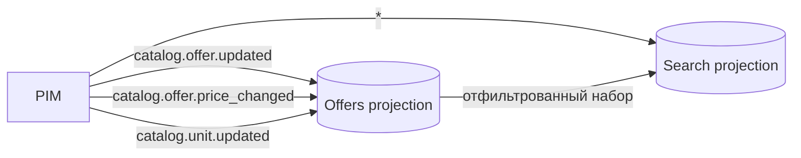

# EVENTS-001 — Модель событий каталога

> Реестр событий, продюсеров и консьюмеров слоя Catalog (этап 2 `short-plan.md`).
> Схемы — `schemas/*.json` (JSON Schema draft 2020-12), совместимость проверяется
> `cmd/breaking-check` (FR-004, BDD-032#S-6, S-7).

## 1. Общий конверт (envelope)

Все события имеют общие поля — они обязательны (`required`) в каждой схеме:

| Поле | Тип | Назначение |
|------|-----|------------|
| `event_id` | string(uuid) | идемпотентность (дубль `Nats-Msg-Id`); уникален на продюсера |
| `aggregate_id` | string | агрегат, к которому относится событие (например, `offer:<id>`) |
| `aggregate_version` | integer ≥ 1 | монотонная версия агрегата; устаревшие/дублирующие события не откатывают read model |

Правила идемпотентности: консьюмер применяет событие только если его
`aggregate_version` строго больше последней применённой для этого `aggregate_id`
(см. `docs/short-plan.md` §2 — «дубль или устаревшее событие не должны откатывать read model»).

## 2. Каталог событий

| Событие ($id) | Файл схемы | Продюсер | Консьюмеры | Триггер |
|---------|------------|----------|------------|---------|
| `catalog.offer.updated.v1` | `catalog.offer.updated.json` | PIM (владение оффером) | Offers projection, Search projection | создание/изменение оффера (price, stock, name, категория) |
| `catalog.offer.price_changed.v1` | `catalog.offer.price_changed.json` | PIM | Offers projection, Search projection | изменение цены оффера (`old_price` → `new_price`) |
| `catalog.unit.updated.v1` | `catalog.unit.updated.json` | PIM (управление тенантами) | Offers projection, Search projection, Identity (продавец) | смена статуса unit (`active/suspended/blocked`), пересвязка продавцов |

Файлы схем сохраняют имя без суффикса версии (`catalog.offer.updated.json`),
версия зафиксирована в `$id` (см. §5).

Домены, чьи события появятся позже (CMS, Marketing и т.п.) — регистрируются в этом
реестре по мере появления слоёв (PRD-032, Q-4).

## 3. Связь событие → projection

- Offers projection хранит актуальное состояние оффера (по `aggregate_version`);
- Search projection переиндексируется из Offers + событий `catalog.unit.updated`
  (статус unit влияет на видимость офферов);
- `catalog.offer.price_changed` содержит `old_price`/`new_price` — консьюмер может
  строить ценовые тренды без чтения состояния агрегата.

## 4. Правила обратной совместимости (registry, FR-004)

Проверка `cmd/breaking-check` (реализация `internal/breaking`):

| Изменение схемы | Вердикт (фактический вывод `breaking-check`) |
|-----------------|---------|
| удалено обязательное поле | breaking — блокирует PR: `[breaking] $.price: удалено обязательное поле` + `BREAKING CHANGES DETECTED` |
| добавлено обязательное поле | breaking — блокирует PR |
| изменён тип поля | breaking — блокирует PR |
| удалено значение enum / изменён список enum | breaking — блокирует PR |
| сужен диапазон (minimum увеличен, maximum уменьшен) | breaking — блокирует PR |
| добавлено опциональное поле | compatible (additive) — пропускается: `ok`, exit 0 |
| удалено опциональное поле | warning — не блокирует |

Exit code: 0 — ок; 1 — найдены breaking-изменения. CI: `ci/check-schemas.yml`
(валидация + diff против origin/main).

## 5. Версионирование и политика

- Схема события версионируется только в пределах «одна схема на событие»
  (суффикс `.v1` в `$id` для согласованности с BDD-032#S-6); аддитивные изменения
  не требуют новой версии.
- Изменение конверта (добавление обязательного поля в envelope) — breaking для
  всех событий: сначала продюсер, затем консьюмеры, затем registry (add → backfill → drop).
- Контракт события для нового слоя добавляется вместе с продюсером, до публикации
  в JetStream.

## 6. Открытые вопросы

- [ ] Q-1 (PRD-032): инструмент сравнения схем — `buf breaking` (Protobuf) или
  текущий JSON Schema diff; при переходе на Protobuf реестр переезжает на `.proto`.
